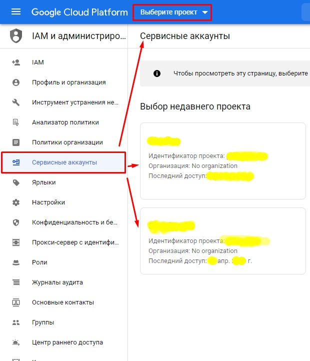
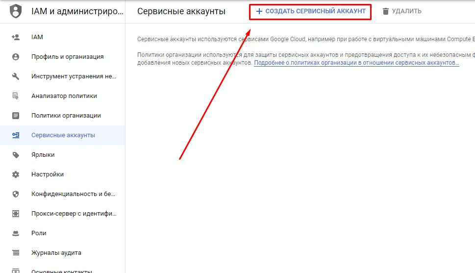
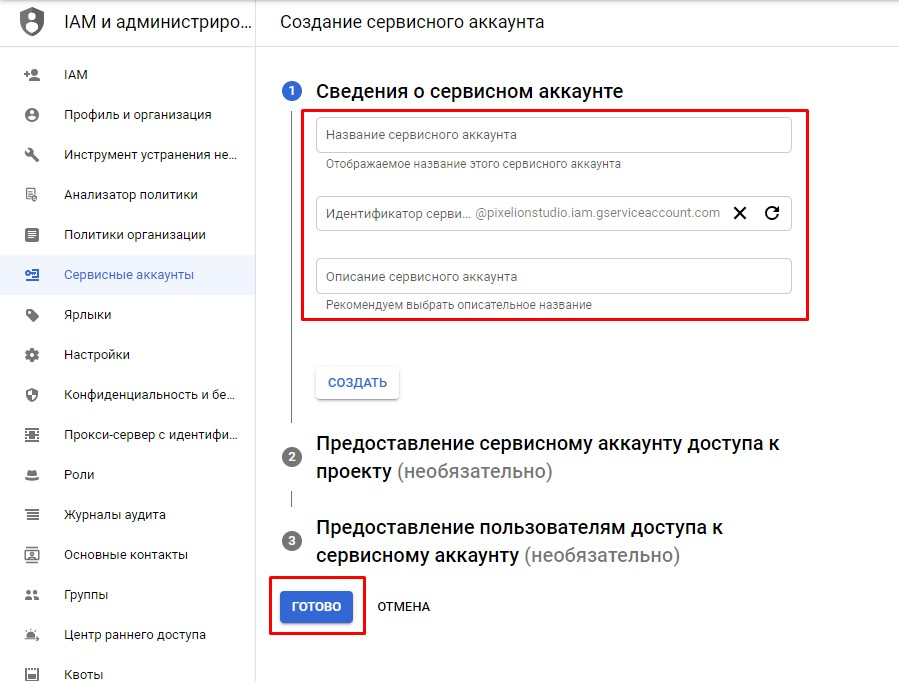
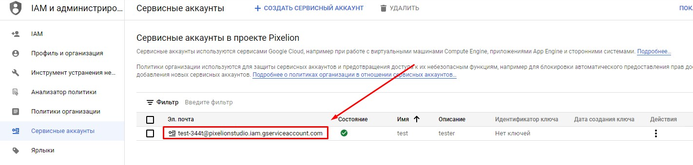
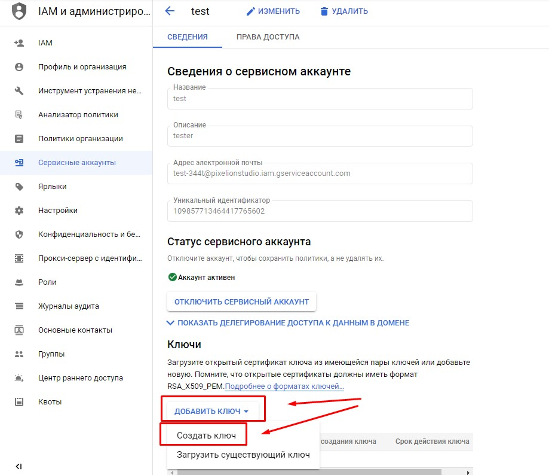
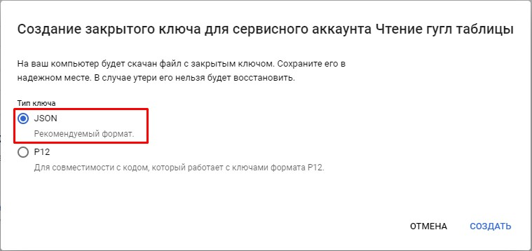
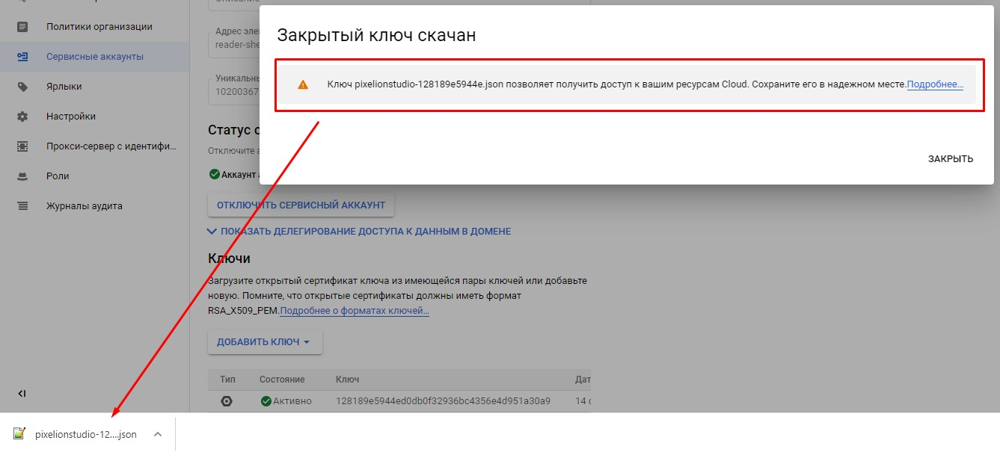

# Создание сервисного аккаунта в Google

Перейдите по ссылке [https://console.developers.google.com/iam-admin/serviceaccounts](https://console.developers.google.com/iam-admin/serviceaccounts)

#### 1. Выберите проект (если его у вас нет, необходимо создать.)

#### 2. Нажмите кнопку "создать сервисный аккаунт"

#### 3. Заполните поля и нажмите "ГОТОВО"

#### 4. Веберите тип ключа "JSON" и нажмите "СОЗДАТЬ"

#### 1. 1

#### 1. 1

#### 1. 1

Загрузите файл

Разрешение доступов Табилце
<YUAR_NAME>@<YUAR_NAME>.iam.gserviceaccount.com

### Готово.

Следующий Шаг №2  [(Разрешение доступов к Google таблице)](sheet_access.md)

