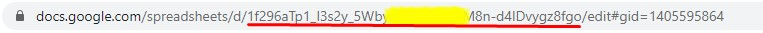
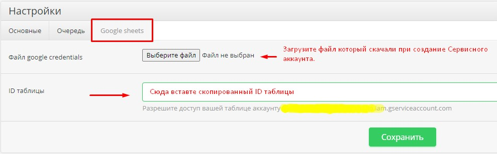

# Настройка модуля

#### 1. Откройте вашу таблицу и скпируйте ID таблицы и встевне в нужный инпут в настройках.

#### 2. Зайдите в настройки модуля.

### Готово.

Выполните Шаг №4  [(Настройка крон)](README.md)

