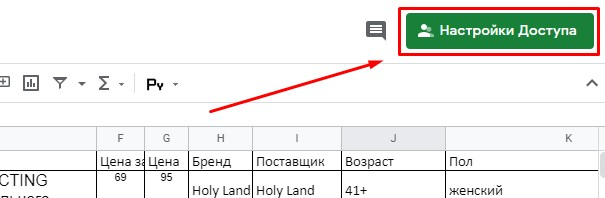
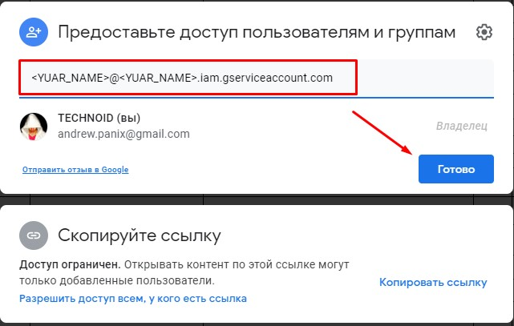
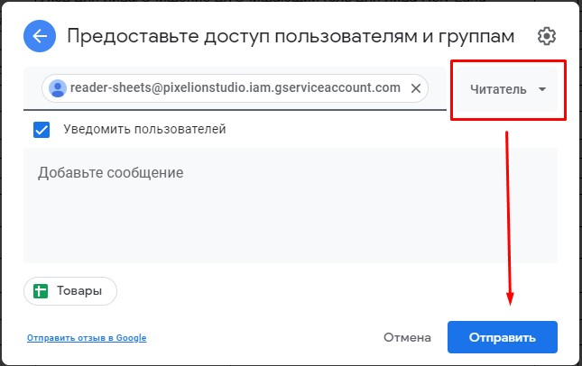
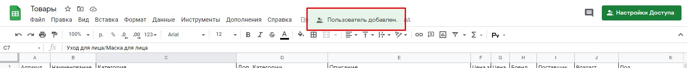

# Разрешение доступов таблице

#### 1. Откройте вашу google таблицу

#### 2. Разрешите доступ вашему "[Сервисному аккаунту](create_account.md)"

#### 3. Настройте права доступа и подтвердите

#### 4. Готово!

Следующий Шаг №3  [(Настройка модуля)](setting_module.md)

